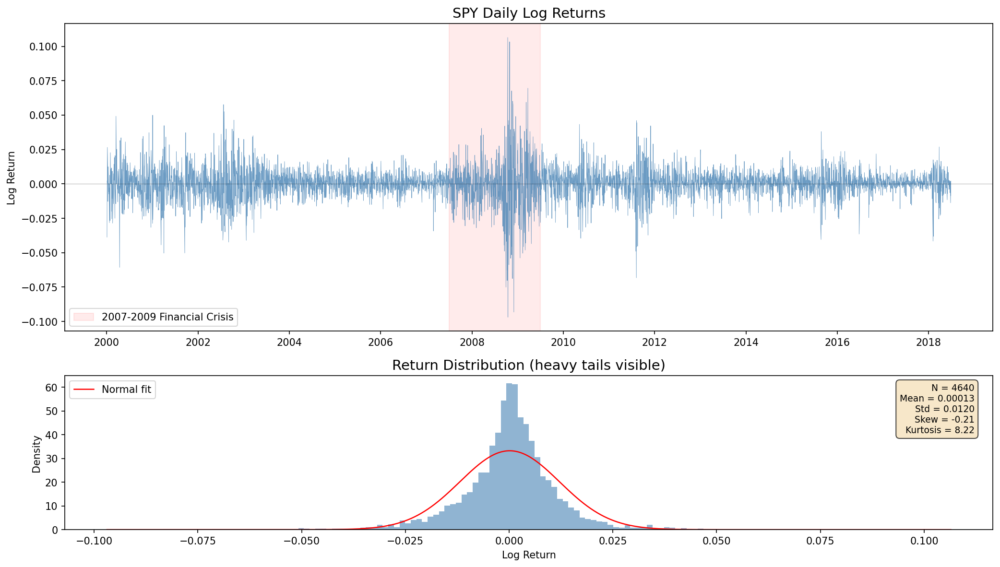
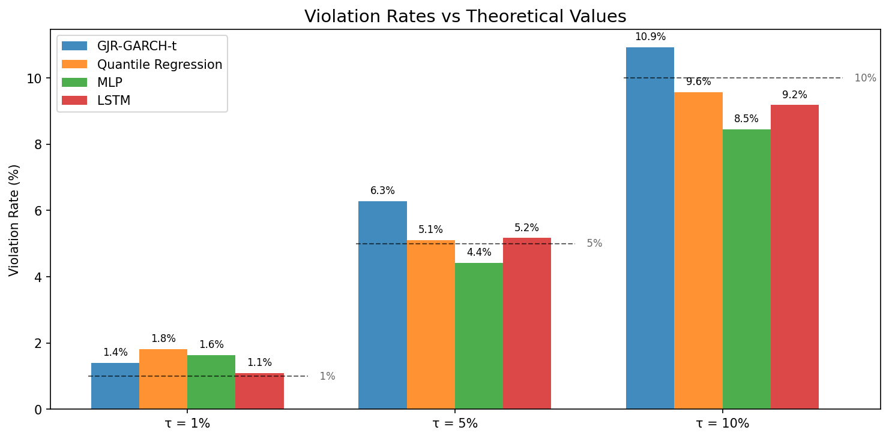
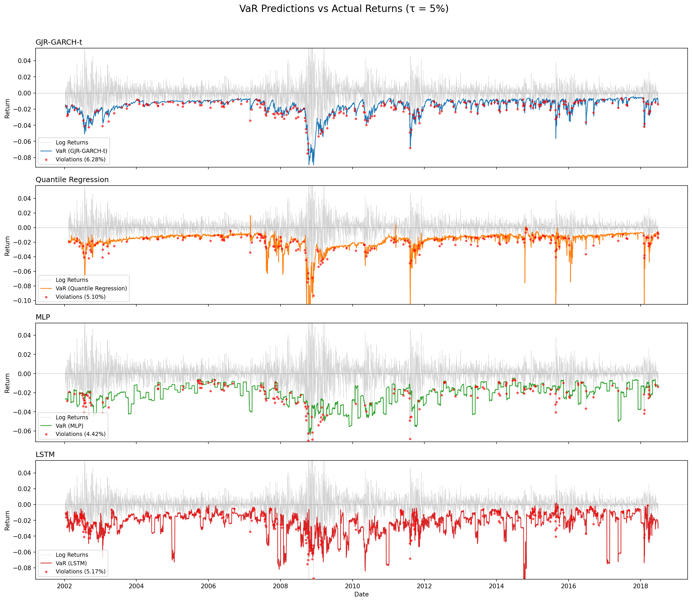
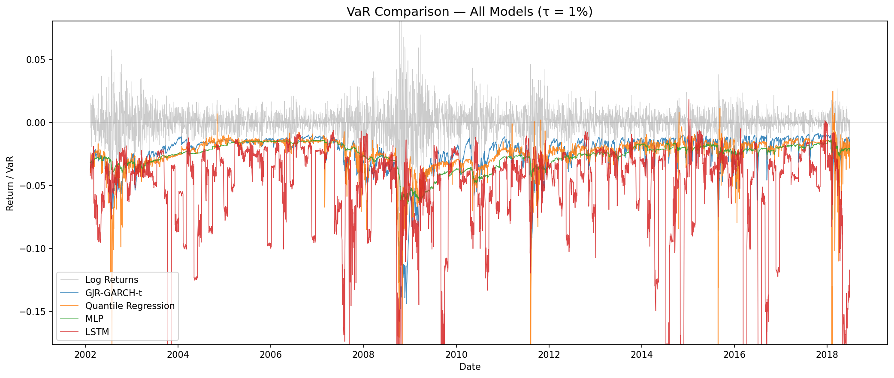
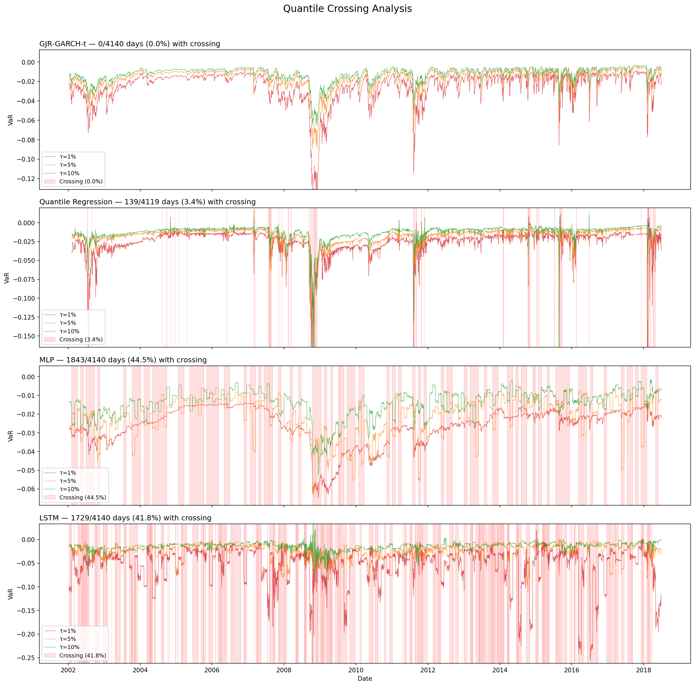

# Comprehensive Report on SPY Value-at-Risk Forecasting

## 1. Research Objective

This project constructs multiple Value-at-Risk (VaR) forecasting models for the daily log returns of the SPDR S&P 500 ETF (SPY), covering three confidence levels ($\tau = 1\%, 5\%, 10\%$). Model performance is evaluated by comparing the empirical violation rate against the nominal level $\tau$.

## 2. Data Description

| Item | Description |
|------|-------------|
| Asset | SPDR S&P 500 ETF (SPY) |
| Sample period | 2000-01-04 to 2018-06-27 |
| Observations | 4,640 trading days |
| Variables | `log_ret` (daily log return), `rv5` (realized volatility, 5-minute), `bv` (bipower variation) |

The return series exhibits characteristics typical of financial time series: leptokurtosis (kurtosis 8.22), negative skewness (skewness $-0.21$), volatility clustering, and leverage effects. Volatility increased markedly during the 2008 financial crisis.

*Figure 1: The upper panel displays the SPY daily log return series (the red shaded region marks the 2007--2009 financial crisis). The lower panel shows the return distribution histogram (the red curve is a normal fit), revealing pronounced heavy tails.*

## 3. Methodology

### 3.1 Quantile Regression

Following Koenker & Bassett (1978), we employ linear quantile regression with a Heterogeneous Autoregressive (HAR) feature set:

$$Q_{\tau}(r_t | \mathbf{x}_t) = \mathbf{x}_t' \boldsymbol{\beta}_\tau$$

Features are constructed under the HAR-RV-J framework (Corsi, 2009; Andersen et al., 2007): $BV^{(d)}$ (daily bipower variation), $BV^{(w)}$ (weekly average), $BV^{(m)}$ (monthly average), and $J_d = \max(RV_d - BV_d, 0)$ (jump component).

The loss function is the pinball loss:

$$\mathcal{L}_\tau(r, q) = \begin{cases} \tau (r - q) & \text{if } r \geq q \\ (1-\tau)(q - r) & \text{if } r < q \end{cases}$$

### 3.2 GARCH-Family Models

Conditional heteroskedasticity models are employed to capture volatility dynamics:

**GARCH(1,1)** (Bollerslev, 1986):

$$\sigma_t^2 = \omega + \alpha \varepsilon_{t-1}^2 + \beta \sigma_{t-1}^2$$

**GJR-GARCH-t** (Glosten et al., 1993): This specification introduces a leverage term $\gamma I(\varepsilon_{t-1}<0)\varepsilon_{t-1}^2$ to capture asymmetric volatility responses, with standardized residuals following a Student's $t$ distribution.

VaR is computed via the quantile function of the conditional distribution: $\text{VaR}_{\tau,t} = \mu_t + \sigma_t \cdot F^{-1}(\tau)$

### 3.3 MLP Deep Quantile Regression

Following the Deep Quantile Estimator of Chronopoulos et al. (2024, JFE), we employ a multilayer perceptron (MLP) to estimate conditional quantiles. A separate network is trained independently for each $\tau$, using the pinball loss as the objective function.

**Architecture**: Input layer $\to$ $L$ hidden layers ($J$ neurons per layer, ReLU activation) $\to$ Dropout $\to$ Output layer (1 neuron)

**Feature set**: $r_{t-1}$, $\hat{\sigma}_{t}^{GARCH}$ (GARCH conditional volatility)

### 3.4 LSTM Quantile Regression

Following the GARCHNet architecture of Buczynski & Chlebus (2023, Computational Economics):

**Architecture**: Input sequence $\to$ 1-layer LSTM (hidden_size $h$) $\to$ Dropout $\to$ FC (fc_units) $\to$ ReLU $\to$ FC(1)

**Features**: Only historical return sequences are used as input. Each $\tau$ is trained independently with the pinball loss.

## 4. Experimental Setup

### 4.1 Rolling Window

All final models employ a 500-day rolling window, yielding a test set of 4,140 days. For each forecast date, the model parameters are re-estimated using the preceding 500 days, and a one-day-ahead VaR forecast is produced.

### 4.2 MLP/LSTM Rolling Window Training

- Retraining frequency: every 20 steps
- Training protocol: the initial fit uses early stopping (patience = 10) to determine the optimal number of epochs (best_epoch); subsequent refits use fixed_epochs mode
- Gradient clipping: max_norm = 1.0

### 4.3 Hyperparameter Search

**MLP hyperparameter search** (grid search, fixed-window 80/20 split): $L \in \{1,2,3,4,5,10\} \times J \in \{1,2,3,4,5,10\} \times lr \in \{0.01, 0.001, 0.0001\} \times dropout \in \{0, 0.5\} \times weight\_decay \in \{0, 0.0001\}$. The search was conducted under a fixed-window setting, and the optimal hyperparameters were directly applied to the 500-day rolling window evaluation. Note that the data partitioning schemes differ between the two settings.

**Optimal MLP hyperparameters**:

| $\tau$ | $L$ | $J$ | lr | dropout | weight_decay |
|--------|-----|-----|----|---------|-------------|
| 1% | 1 | 1 | 1e-4 | 0.0 | 1e-4 |
| 5% | 1 | 4 | 0.01 | 0.0 | 1e-4 |
| 10% | 1 | 1 | 0.01 | 0.0 | 1e-4 |

**LSTM hyperparameter search**: $h \in \{32,64,100\} \times fc \in \{16,32,64\} \times seq \in \{10,20\} \times dropout \in \{0,0.2\} \times lr \in \{3\text{e-4},1\text{e-3},1\text{e-2}\} \times wd \in \{0,1\text{e-4}\}$, totaling 216 combinations. The search was performed on the first 500 observations (`df.iloc[:500]`), with an internal 80/20 train/validation split. It should be noted that this search window fully overlaps with the first training window of the rolling forecast, so the selected hyperparameters may exhibit some selection bias toward the early portion of the data.

**Optimal LSTM hyperparameters**:

| $\tau$ | hidden_size | fc_units | seq_len | dropout | lr | weight_decay |
|--------|-------------|----------|---------|---------|------|-------------|
| 1% | 100 | 16 | 10 | 0.0 | 0.01 | 0.0 |
| 5% | 32 | 32 | 10 | 0.0 | 0.01 | 0.0 |
| 10% | 100 | 64 | 20 | 0.2 | 0.01 | 0.0 |

## 5. Results and Analysis

### 5.1 Violation Rate Summary

The violation rate is defined as the proportion of days on which the realized return falls below the VaR forecast. Under correct conditional coverage, the violation rate should equal $\tau$.

| Model | $\tau=1\%$ | $\tau=5\%$ | $\tau=10\%$ |
|------|-----------|-----------|------------|
| Quantile Regression | 1.82% | 5.10% | 9.57% |
| GJR-GARCH-t | 1.40% | 6.28% | 10.92% |
| MLP | 1.64% | 4.42% | 8.45% |
| **LSTM** | **1.09%** | **5.17%** | **9.18%** |
| Nominal | 1.0% | 5.0% | 10.0% |

The LSTM violation rates are closest to the nominal levels across all three values of $\tau$.

*Figure 2: Violation rates for each model compared against the nominal levels (dashed lines). The LSTM is closest to the nominal rate at all three $\tau$ levels, while GJR-GARCH-t systematically overshoots at $\tau=5\%$ and $\tau=10\%$.*

### 5.2 Comparative Analysis

1. **Violation rate accuracy**: The LSTM achieves violation rates closest to the nominal levels (1.09% / 5.17% / 9.18%), followed by QR (1.82% / 5.10% / 9.57%). GJR-GARCH-t exceeds the nominal rate at $\tau=5\%$ and $\tau=10\%$, while the MLP undershoots at $\tau=10\%$.

2. **Model characteristics**: As a linear method, QR offers structural simplicity and stable performance at moderate quantile levels. GJR-GARCH-t captures asymmetric volatility via the leverage term but tends to produce excessively high violation rates at $\tau=5\%$ and $\tau=10\%$. Both MLP and LSTM improve forecast accuracy through nonlinear modeling, with the LSTM leveraging sequential dependence to achieve the best violation rates across all $\tau$.

*Figure 3: VaR forecasts (colored lines) and realized returns (gray line) at $\tau=5\%$; red dots indicate violation events. The GJR-GARCH-t VaR is smooth and responds prominently to the 2008 crisis; QR exhibits sharp jumps during extreme periods; the MLP VaR adjusts relatively slowly; the LSTM VaR tracks volatility changes most responsively.*

3. **Aggressive LSTM forecasts at $\tau=1\%$**: The LSTM produces a mean VaR of $-5.40\%$ at $\tau=1\%$ (standard deviation $5.75\%$), substantially larger in magnitude than the GJR-GARCH-t mean of $-2.51\%$ (standard deviation $1.72\%$), with the most extreme forecast reaching $-76.3\%$. This indicates that the LSTM exhibits far greater forecast variability at extreme quantiles compared to parametric models. Although the violation rate of 1.09% is close to the nominal level, this comes at the cost of excessively conservative VaR estimates, which in practice could result in disproportionately high capital reserve requirements.

*Figure 4: Overlay of VaR forecasts from all four models at $\tau=1\%$. The LSTM (red) frequently plunges below $-10\%$ and beyond, contrasting sharply with the smoother forecasts of GJR-GARCH-t (blue), QR (orange), and MLP (green).*

### 5.3 Quantile Monotonicity Analysis

Because each $\tau$ is modeled independently, the forecasts across different quantile levels may violate the monotonicity constraint $\text{VaR}_{1\%} < \text{VaR}_{5\%} < \text{VaR}_{10\%}$ (i.e., quantile crossing).

| Model | $\text{VaR}_{1\%} > \text{VaR}_{5\%}$ | $\text{VaR}_{5\%} > \text{VaR}_{10\%}$ | Any crossing |
|------|-------|--------|------|
| LSTM | 14.2% (588/4140) | 28.0% (1161/4140) | 41.8% (1729/4140) |
| MLP | 21.7% (900/4140) | 22.8% (943/4140) | 44.5% (1843/4140) |
| QR | 2.4% (99/4119) | 1.5% (60/4119) | 3.4% (139/4119) |
| GJR-GARCH-t | 0% | 0% | 0% |

The LSTM and MLP exhibit high rates of quantile crossing, a well-known drawback of per-$\tau$ independent training. GJR-GARCH-t, being based on a parametric conditional distribution, inherently satisfies monotonicity. QR shows a very low crossing rate, as the quantile hyperplanes of a linear model are smoother. Potential remedies include joint quantile regression or post-hoc sorting, but these approaches are beyond the scope of this study.

*Figure 5: Three-quantile forecast lines ($\tau=1\%/5\%/10\%$) for all four models, with red shading indicating crossing regions. GJR-GARCH-t has no crossings (0%), QR has a minimal crossing rate (3.4%), while MLP (44.5%) and LSTM (41.8%) display dense crossing regions throughout the forecast period.*

### 5.4 Summary of Methodological Exploration

Prior to finalizing the model configurations, the following explorations were conducted:

- **Window length**: A comparison of 250-day and 500-day rolling windows showed that the 500-day window yields violation rates closer to the nominal levels across all models, providing more reliable tail risk estimation.
- **LSTM feature sets**: Three input configurations were compared --- returns only, HAR volatility features, and GARCH conditional volatility. The returns-only configuration achieved the highest signal-to-noise ratio and the best violation rates; additional volatility features introduced noise under the limited training sample.
- **LSTM hyperparameter search**: Under default hyperparameters (lr = 3e-4, hidden = 64), the LSTM was severely overconservative (violation rates well below nominal levels). A grid search over 216 combinations led to substantial performance gains, with the learning rate (0.01) identified as the most critical hyperparameter.
- **MLP fixed window vs. rolling window**: Under the fixed-window (80/20 split) setting, the MLP produced violation rates that were severely below nominal levels or even degenerated entirely. The rolling window scheme markedly improved model adaptability.

## 6. Conclusions

1. **LSTM quantile regression** achieves the highest violation rate accuracy, with all three $\tau$ levels closest to the nominal values. Hyperparameter tuning is essential --- increasing the learning rate from the default 3e-4 to 0.01 produced a decisive improvement. However, this comes at a cost: VaR forecasts at $\tau=1\%$ are highly volatile (mean $-5.40\%$, most extreme $-76.3\%$), and 41.8% of forecast days exhibit quantile crossing, necessitating additional post-processing in practical risk management applications.

2. **Quantile Regression (QR)**, as a linear method, produces violation rates close to nominal at $\tau=5\%$ and $\tau=10\%$, with a quantile crossing rate of only 3.4%, making it a practical choice that balances stability and accuracy.

3. **GJR-GARCH-t** inherently satisfies quantile monotonicity and captures asymmetric heavy-tailed behavior through the leverage term and the Student's $t$ distribution. However, its violation rates exceed the nominal levels at $\tau=1\%$ and $\tau=5\%$, indicating limitations in the conditional distributional assumptions.

4. **MLP** achieves the best violation rate at $\tau=5\%$ (4.42%), but its quantile crossing rate reaches 44.5%, reflecting the same limitation of the per-$\tau$ independent training framework shared with the LSTM.

5. Key findings from the experimental exploration include: a 500-day window outperforms a 250-day window; parsimonious features (returns only) outperform richer feature sets; and rolling windows outperform fixed windows. Considering violation rate accuracy, forecast stability, and quantile monotonicity jointly, no single model dominates across all dimensions. In practice, model selection should be guided by the specific requirements of the application.

## 7. References

- Bollerslev, T. (1986). Generalized autoregressive conditional heteroskedasticity. *Journal of Econometrics*, 31(3), 307-327.
- Buczynski, M. & Chlebus, M. (2023). GARCHNet --- Value-at-Risk forecasting with GARCH models based on neural networks. *Computational Economics*.
- Andersen, T. G., Bollerslev, T. & Diebold, F. X. (2007). Roughing it up: Including jump components in the measurement, modeling, and forecasting of return volatility. *Review of Economics and Statistics*, 89(4), 701-720.
- Chronopoulos, I., Ames, M., & Daskalakis, G. (2024). Forecasting Value-at-Risk Using Deep Neural Network Quantile Regression. *Journal of Financial Econometrics*, 22(3), 636-669.
- Glosten, L. R., Jagannathan, R. & Runkle, D. E. (1993). On the relation between the expected value and the volatility of the nominal excess return on stocks. *Journal of Finance*, 48(5), 1779-1801.
- Corsi, F. (2009). A simple approximate long-memory model of realized volatility. *Journal of Financial Econometrics*, 7(2), 174-196.
- Koenker, R. & Bassett, G. (1978). Regression quantiles. *Econometrica*, 46(1), 33-50.
